# PRD：AI数字人 Agent（云API版）MVP

## 1. 文档信息
- 文档版本：v1.0
- 产品阶段：MVP（主流程可演示、可试用）
- 技术前提：LLM 使用云 API
- 目标：尽快跑通“可视化数字人 + 语音交互 + 记忆 + 情感 + 执行能力”主流程

---

## 2. 背景与问题定义

用户希望与数字人通过语音自然交互，不只是“聊天”，而是具备：
1. **可持续记忆**（记住用户偏好、历史事件、任务上下文）  
2. **情感表达**（语气、表情、状态连续）  
3. **执行能力**（可调用工具完成实际任务）  
4. **低延迟主流程体验**（尽快看到可用效果）

---

## 3. 产品目标与非目标

### 3.1 MVP目标（必须达成）
1. 用户可以按住说话/连续说话与数字人实时对话（支持打断）
2. 数字人具备基本表情与口型同步
3. Agent 能调用至少 3 类工具（查询类、写入类、通知类）
4. 具备短期记忆 + 长期记忆（可检索并影响回复）
5. 有简化情绪状态机，影响回复措辞与语音风格
6. 提供可演示的“端到端闭环”（说一句 -> 理解 -> 执行 -> 反馈）

### 3.2 MVP非目标（暂不做）
1. 高精度影视级数字人建模与动作捕捉
2. 多角色复杂剧情系统
3. 高风险自动化执行（支付、删库、外部不可逆动作）
4. 全量多模态感知（摄像头视觉理解）在 MVP 内仅预留接口

---

## 4. 用户画像与核心场景

### 4.1 用户画像（MVP聚焦）
- 内容创作者 / 独立开发者 / 知识工作者
- 需要“随时问、随时记、随时办”

### 4.2 核心场景
1. **问答+记忆**：  
   “我下周要准备 AI 分享会，记住我偏好‘商业化案例优先’。”  
2. **任务执行**：  
   “帮我整理 3 条最近 AI Agent 行业动态并发到飞书。”  
3. **情绪陪伴式反馈**：  
   用户焦虑表达时，数字人用更缓和语气回应并给出行动建议。

---

## 5. 方案总览（MVP）

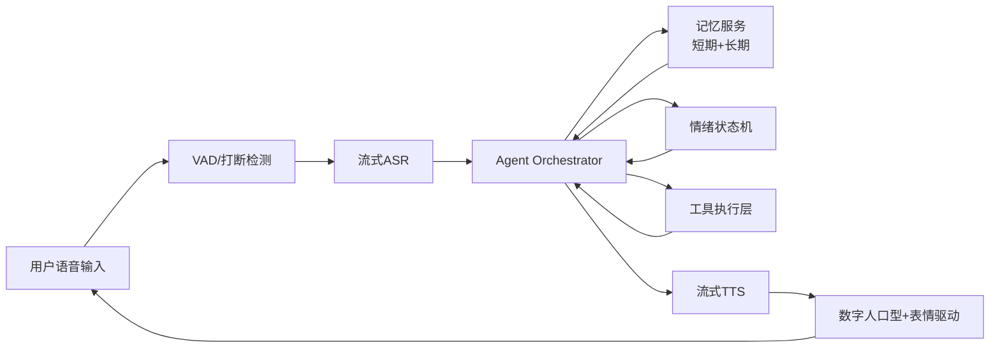

---

## 6. 信息架构

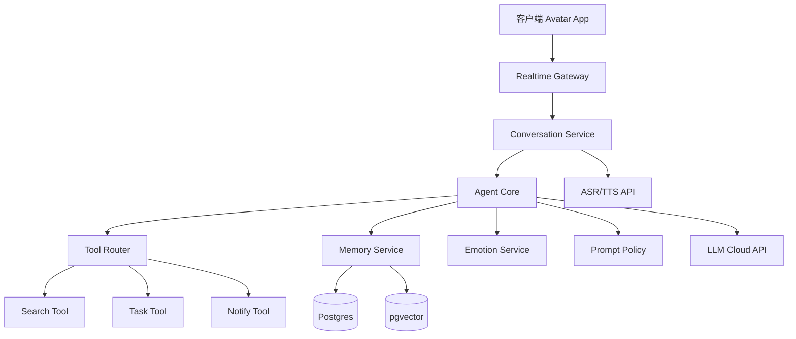

---

## 7. 端到端主流程（重点）

### 7.1 用户主流程图（Happy Path）

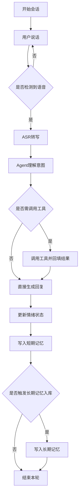

### 7.2 实时语音时序图（含打断）

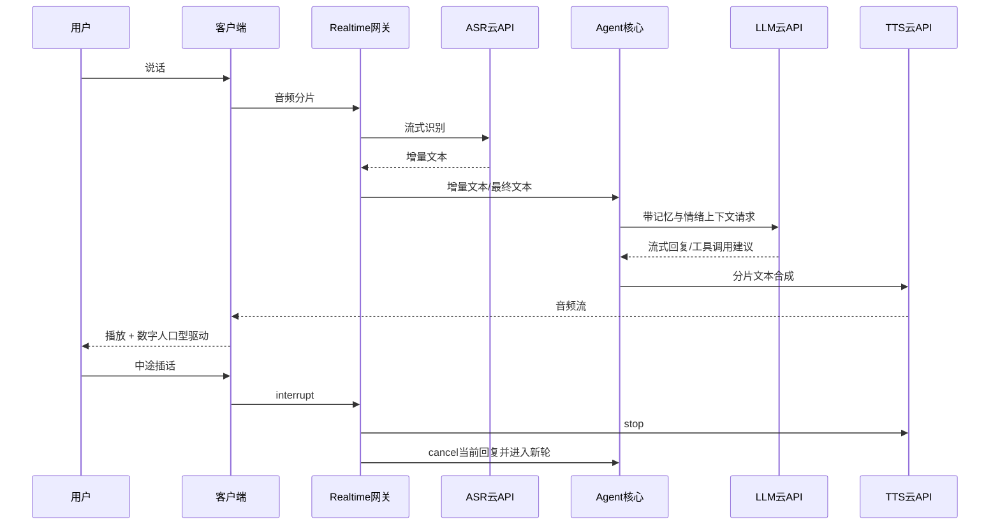

---

## 8. Agent 编排设计（MVP）

### 8.1 编排状态机

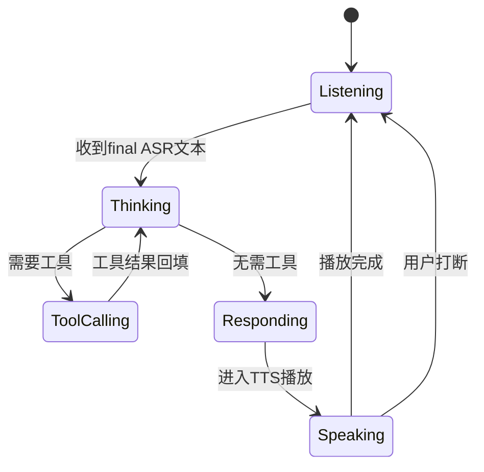

### 8.2 工具调用流程

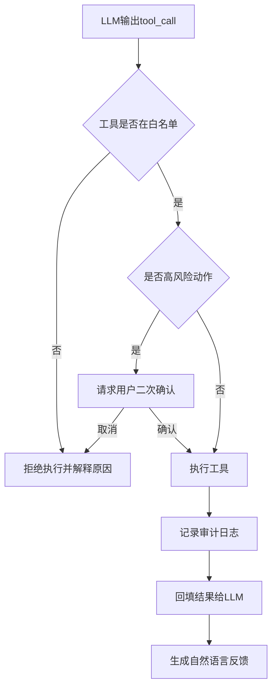

---

## 9. 记忆系统设计（MVP可用版）

### 9.1 记忆分层
- **工作记忆（短期）**：当前会话窗口（Redis，可过期）
- **长期记忆（语义）**：用户偏好、事实事件、任务历史（Postgres + pgvector）
- **程序记忆（规则）**：用户限制与偏好策略（如“不自动外发敏感信息”）

### 9.2 记忆读写流程

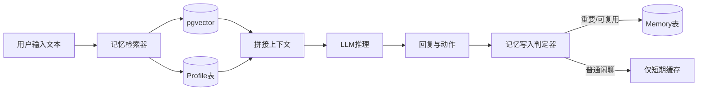

### 9.3 长期记忆数据结构（示例）
```json
{
  "memory_id": "mem_20260326_001",
  "user_id": "u_001",
  "type": "preference",
  "content": "用户偏好商业化案例优先",
  "source": "conversation",
  "confidence": 0.87,
  "created_at": "2026-03-26T12:00:00Z",
  "last_used_at": "2026-03-26T12:30:00Z"
}
```

---

## 10. 情绪系统设计（MVP轻量）

### 10.1 情绪状态集合
- `calm`（平稳）
- `positive`（积极）
- `concerned`（关切）
- `focused`（专注）

### 10.2 情绪流转图

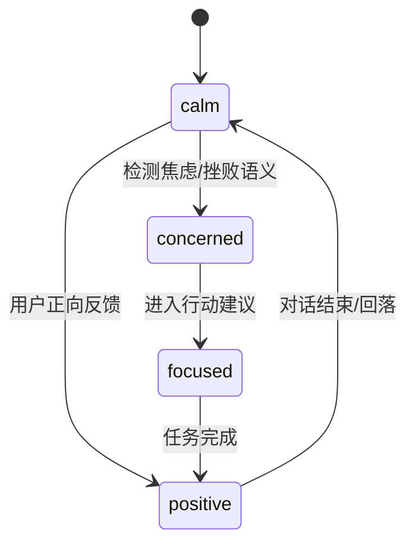

### 10.3 情绪对输出的影响
1. Prompt 中注入语气约束（更简洁/更共情）
2. TTS 参数调整（语速、停顿、音高）
3. Avatar 表情权重调整（眉眼、嘴角）

---

## 11. 数字人渲染与交互设计（MVP）

### 11.1 渲染管线

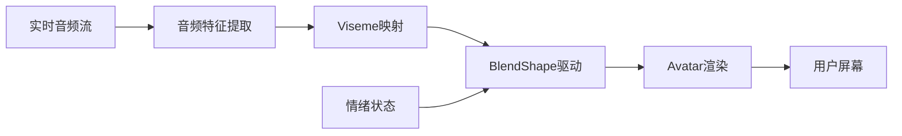

### 11.2 交互控件（最小集合）
1. 麦克风按钮（按住说/连续说）
2. 中断按钮（立即打断当前播报）
3. 任务卡片（显示工具执行结果）
4. 记忆卡片（显示“我记住了什么”）

---

## 12. 功能范围（MVP）

### 12.1 P0（本期必须）
1. 实时语音对话（ASR/TTS）
2. LLM 对话与 Function Calling
3. 3类工具：
   - `search_brief`（信息查询）
   - `save_memory`（写入记忆）
   - `send_notification`（发送通知）
4. 短期 + 长期记忆检索
5. 简化情绪状态机
6. 数字人口型与基础表情联动

### 12.2 P1（下一步）
1. 多工具并行规划
2. 记忆自动整理/冲突消解
3. 个性化声音克隆
4. 周度记忆复盘报告

---

## 13. 非功能需求（NFR）

1. 首字响应延迟（用户说完到开始播报）目标：<= 1.5s（理想）
2. 单轮完整响应（短回答）目标：<= 4s（网络依赖）
3. 可用性：核心链路成功率 >= 99%
4. 可观测性：全链路 trace_id，工具调用日志可追踪
5. 安全性：API Key 加密存储，敏感工具必须二次确认

---

## 14. 异常与降级策略

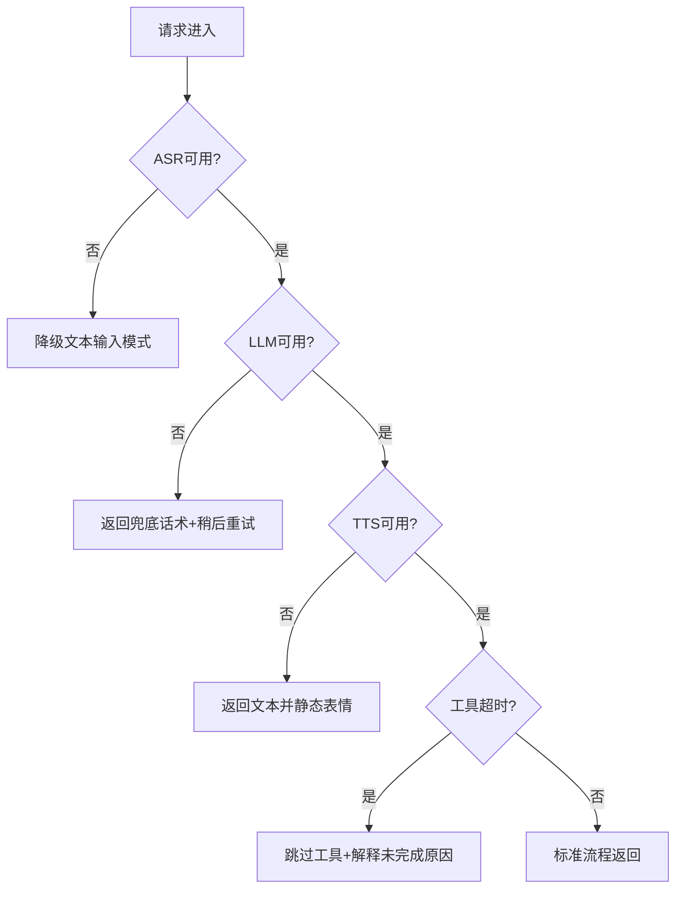

---

## 15. 技术架构图（部署拓扑）

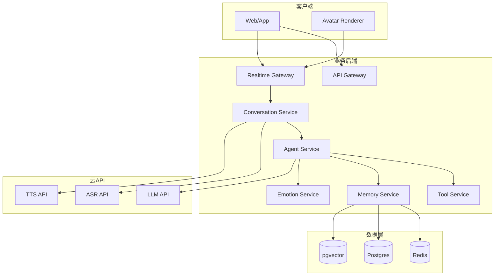

---

## 16. API 草案（MVP）

### 16.1 会话接口
- `POST /v1/session/start`：创建会话
- `POST /v1/session/{id}/interrupt`：打断当前回复
- `WS /v1/session/{id}/stream`：音频/文本双向流

### 16.2 Agent接口
- `POST /v1/agent/respond`：输入文本，返回流式回复与动作
- `POST /v1/agent/tool-callback`：工具结果回填

### 16.3 记忆接口
- `POST /v1/memory`：写入长期记忆
- `GET /v1/memory/search?q=`：语义检索

---

## 17. 数据库草案（核心表）

1. `users`：用户基础信息  
2. `sessions`：会话状态、开始结束时间  
3. `messages`：对话消息（文本、角色、时间）  
4. `tool_calls`：工具调用记录、入参、结果、耗时  
5. `memories`：长期记忆正文与元数据  
6. `emotion_states`：会话情绪快照  
7. `deliveries`：通知发送记录

---

## 18. 验收标准（UAT）

### 18.1 功能验收
1. 可完成 10 轮以上语音对话，不崩溃
2. 至少 3 种工具调用成功并可回显结果
3. 可记住用户偏好，并在后续轮次正确引用
4. 用户打断时，当前播报可在 500ms 内停止
5. 数字人口型与语音基本同步（肉眼无明显错位）

### 18.2 体验验收
1. 用户首次上手 3 分钟内能完成一轮“提问->执行->反馈”
2. 对话风格相对稳定，不出现明显人格漂移

---

## 19. MVP实施路径（按闭环）

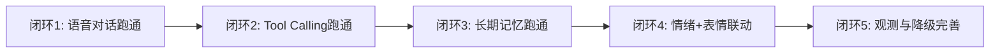

### 闭环说明
1. **闭环1**：ASR -> LLM -> TTS -> Avatar
2. **闭环2**：在闭环1基础上增加工具执行
3. **闭环3**：增加记忆读写与检索
4. **闭环4**：引入情绪状态机影响音色与表情
5. **闭环5**：完善日志、重试、降级

---

## 20. 风险与应对

1. **云API延迟波动**：采用流式输出 + 本地缓存兜底文案  
2. **工具误调用**：白名单 + 二次确认 + 审计日志  
3. **记忆污染**：写入门槛 + 低置信度隔离区  
4. **情绪失真**：状态机约束优先于自由生成  
5. **渲染性能瓶颈**：先保证口型，复杂表情逐步增强

---

## 21. 演示脚本（用于“尽快看到主流程效果”）

1. 用户：`“你好，记住我关注 AI Agent 商业化案例。”`  
2. 数字人：确认记忆写入并语音播报  
3. 用户：`“帮我查 3 条今天的相关动态，并发到飞书。”`  
4. Agent：调用查询工具 -> 调用通知工具 -> 回传执行结果  
5. 用户打断：`“等等，先只发给我自己。”`  
6. 系统：即时中断并重新规划执行  
7. 对话结束后，展示“新增记忆卡片 + 执行日志卡片”

---

## 22. 附录：MVP推荐技术选型（云API版）

- 前端：React + WebSocket + WebRTC（可选）
- 数字人：Three.js + VRM（或 Unity）
- 后端：FastAPI / NestJS（二选一）
- Agent编排：LangGraph（或轻量状态机）
- 数据：Postgres + pgvector + Redis
- 云能力：LLM API + ASR API + TTS API
- 可观测：OpenTelemetry + Prometheus + Grafana

> 备注：MVP优先“主流程丝滑可演示”，而非“一次性做满全部能力”。

